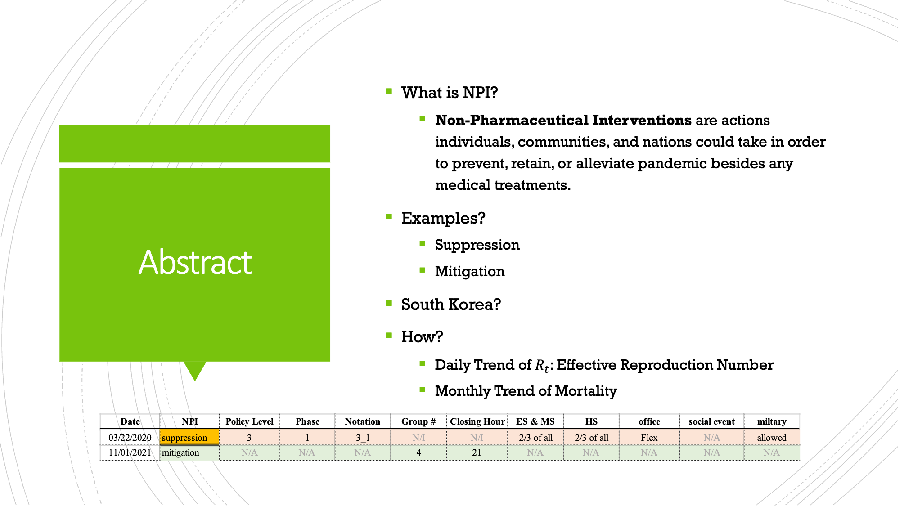
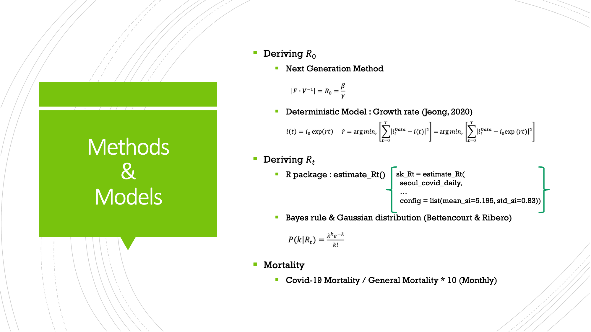
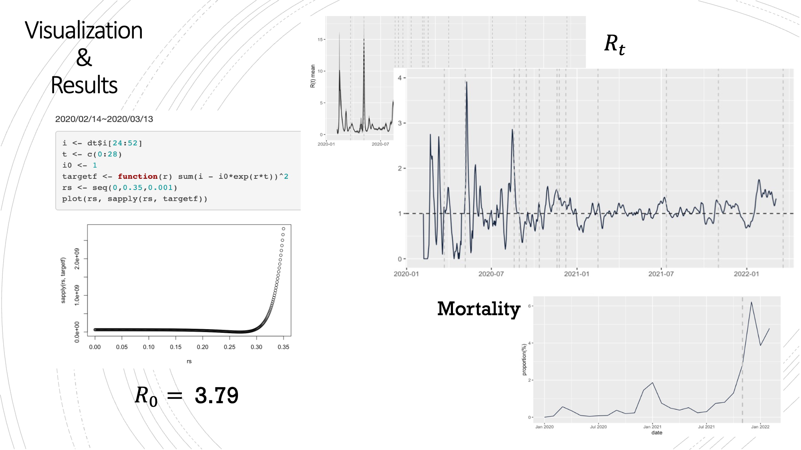
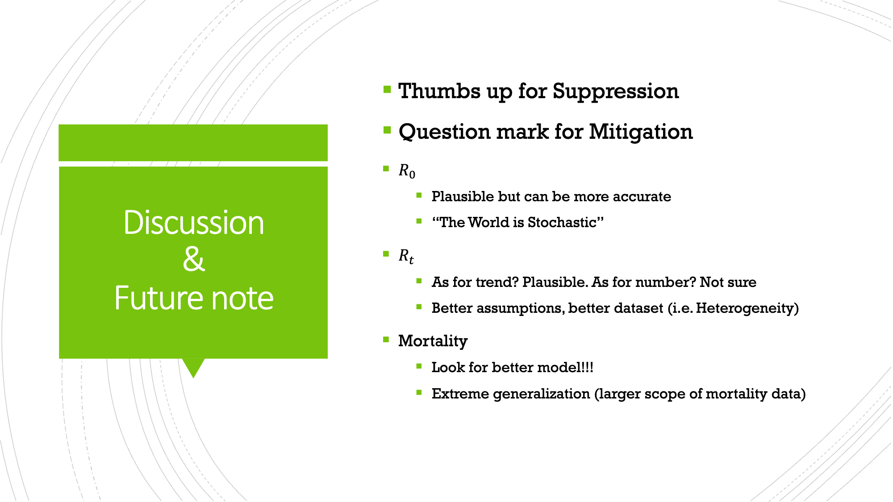

# Evaluation of South Korean NPI against COVID-19
## STAT 430 - Infectious Disease Modeling [SPRING 2022]
Effectiveness of Non-Pharmaceutical Intervention by R0 & Rt Computation
> Ikgyu Shin (ikgyus2@illinois.edu)

## Table of Contents
* [General Information](#general-information)
* [Possible Improvements](#possible-improvements)
* [Acknowledgements](#acknowledgements)

## General Information

Please refer to the abstract section of the written report **temporary-report.pdf** for detailed information.

## Possible Improvements

**Improvements:**
- The evaluation of the effectiveness was simply substantiated by the visual assessment.
- South Korean COVID data were very inconsistent. Therefore, the numbers could be slightly off.
- Perhaps, the methodology utilized in the assessment by itself could be incorrect. 

**How:**
- Evaluation would need a valid, precise means of verification. Rather than a simple visual assessment, I could incorporate statistical computation. 
- Considering the inconsistency, more data in a consistent format could be a great source of substantiation.

## Acknowledgements

- *This project borrowed knowledges from __[this R package documentation](https://rdrr.io/cran/EpiEstim/src/R/estimate_r.R)__.*
